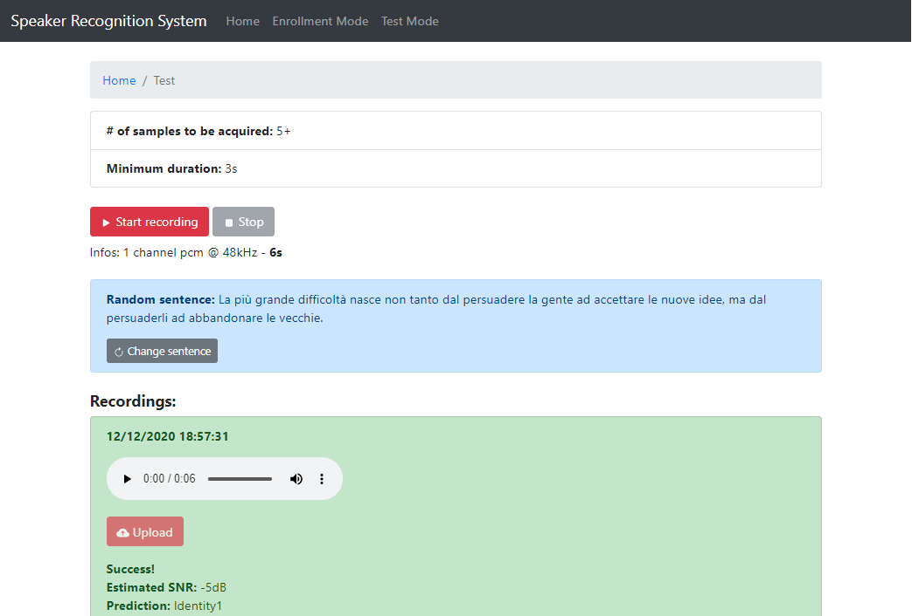

## What this software does?
This software has been developed as part of research in the field of Speaker Identification in open-set scenarios. It consists of a web-app, created through the Python web framework Flask. There are two operating modes. Both of them let the user make a recording (some random sentences are proposed to the user) whose duration must be at least 3s and upload it to perform the enrollment or the recognition. In addition, a real-time application has been built.



## How to use the software?

  - Install the requirements
  ```pip install -r requirements.txt```
  
    In addition ```ffmpeg``` or ```sox``` is required
  - [Download](https://drive.google.com/drive/folders/1tT4_qwSJcpb7wbVqa6WnaWea6ZPWmQLf?usp=sharing) the weights of the models and put them in data/weights:
  
  - The most of the settings (e.g. enable the speech enhancement network) are in ``` config.py ```
  
  - The samples directory follows this structure:
```
    samples/
    samples/meta.json
    samples/embs.pkl
    samples/refs/identity1/0000.wav
    samples/evls/identity1/0000.wav
```
  - To start the web server
  ```python web_app.py```

  - To start the real-time identification software:
  ```python realtime_identification.py```

  - To re-index and re-compute the embeddings:
  ```python index_and_compute_embeddings.py```
  
## Credits
  - [Recognizer](https://github.com/seongmin-kye/meta-SR)
  - [Denoiser](https://github.com/facebookresearch/denoiser)
  - [SNR estimation](https://github.com/anicolson/DeepXi)